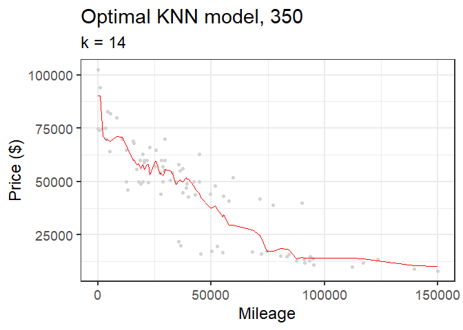

Exercises 1
================
Nathan Franz and Ian McBride

## Data Visualization: Flights at ABIA

Our analysis looks at the probability that departures out of Austin will
be delayed by more than 20 minutes, and uses this metric to highlight
the the 10 worst destinations. Note that, for the purposes of these
figures, cancellations also fall into the “delayed by more than 20
minutes” category.

<!-- --><!-- -->

Similarly, we also used the probability that arrivals into Austin would
be delayed by more than 20 minutes to determine the 10 worst origination
airports. Note that, for the purposes of these figures, cancellations
and diversions also fall into the “delayed by more than 20 minutes”
category.
<!-- --><!-- -->

## K-Nearest Neighbors Model: Car Price

Using the K-nearest neighbors (KNN) model, we examine how mileage
relates to price for two trim levels of the Mercedes S Class: the 350,
and the 65 AMG.

For different values of k, KNN models make varying prediction errors
given out-of-sample data. The following graphs show the relationship
between k-value and root mean square error (RMSE), a measure of
prediction error, for the two different trim levels. The graphs identify
the k-value for which a KNN model minimizes RMSE with a vertical red
line.

<!-- --><!-- -->

Each of the red lines on the graphs above represents the KNN model that
minimizes the RMSE. The graphs that follow show those KNN models plotted
against the test data from which the RMSE data was calculated.

<!-- --><!-- -->

As shown above, the 350’s optimal k-value is larger than the 65 AMG’s.
This may be the case because the sample size for the 350 is larger than
the sample size for the 65 AMG, More bias near the tails may be
counteracted by the improved predictive performance on larger number of
samples nearer the center of the distribution.
