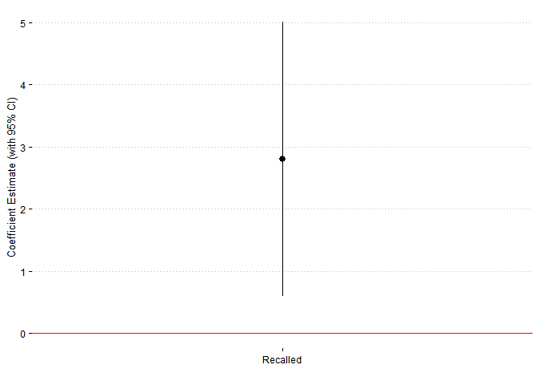

Exercises 2
================
Nathan Franz, Ian McBride, and Claire Roycroft

# Saratoga house prices

In order to predict the market values of properties in the Saratoga, NY
market, our team developed several different models based on the
available data. We then iteratively scored the performance of our models
and implemented various alterations to try to improve each model’s
predictive ability. While we will not delve into many of the technical
details of our analysis in this report, it is important to give a brief
description of the primary measure that we used to evaluate model
performance. This metric, called ‘Root Mean-Squared Error’ (RMSE),
reports an average difference of the value predicted by our model
compared to the actual value of the property. The main goal of our work
was to minimize this value.

To start, our team ran a linear regression on a selection of covariates
that we strongly suspected would have a significant impact on the market
value of a given property. This regression served as the baseline for
further analysis; different variables and interaction terms were
subsequently added or removed, and the predictive accuracy was
re-measured according to the RMSE metric. To rank the relative
importance of terms in our final hand-built model, we then individually
dropped each of the terms from the regression, re-ran it, then compared
the model’s performance without a given covariate to its performance
with the covariate included. This process yielded several mostly
intuitive conclusions; the most important variables to include in our
model were the underlying land value, the living area interacted with
whether a property was newly built, waterfront status, and room
characteristics (with interactions). These results can be seen in the
table below. Additionally, the RMSE of the original model was lower than
each of the models with one excluded term, which verified that all terms
in our regression were positively contributing to our goal of reducing
the overall RMSE.

<table style="text-align:center">

<caption>

<strong>RMSE Impact of Excluding Specified Terms in Linear
Regression</strong>

</caption>

<tr>

<td colspan="2" style="border-bottom: 1px solid black">

</td>

</tr>

<tr>

<td style="text-align:left">

Dropped\_Term

</td>

<td>

RMSE\_Impact

</td>

</tr>

<tr>

<td colspan="2" style="border-bottom: 1px solid black">

</td>

</tr>

<tr>

<td style="text-align:left">

landValue

</td>

<td>

5,738.592

</td>

</tr>

<tr>

<td style="text-align:left">

livingArea \* newConstruction

</td>

<td>

3,676.056

</td>

</tr>

<tr>

<td style="text-align:left">

waterfront

</td>

<td>

1,053.928

</td>

</tr>

<tr>

<td style="text-align:left">

bedrooms \* bathrooms \* rooms

</td>

<td>

783.446

</td>

</tr>

<tr>

<td style="text-align:left">

age \* lotSize

</td>

<td>

263.258

</td>

</tr>

<tr>

<td style="text-align:left">

centralAir

</td>

<td>

118.894

</td>

</tr>

<tr>

<td style="text-align:left">

heating

</td>

<td>

66.753

</td>

</tr>

<tr>

<td colspan="2" style="border-bottom: 1px solid black">

</td>

</tr>

</table>

After we had improved linear regression model as much as possible
manually, we also then proceeded to implement an automated stepwise
variable selection process, which mechanically considered all pairwise
combinations of covariates in the dataset and included all that would be
beneficial to model performance. While it didn’t reveal any new
significant insights, it did slightly improve performance compared to
the manually built model.

Lastly, our team implemented a k-nearest neighbors model with the
covariates from our best hand-built linear model. While the optimal
k-nearest neighbors model significantly outperformed the baseline linear
regression model, it didn’t outperform the best hand-built linear model
or stepwise linear model. This can be seen in the figure below, which
shows the average RMSE values across all values of k and also compares
them to the RMSE values of the other models we tested. (A technical
note: the average RMSE of the linear models and the average RMSE of the
k-nearest neighbor models were calculated using different sets of random
samples from the overall data. While it is typically not optimal to
compare performance across different sets of random samples, this issue
is alleviated by averaging across a large number of random samples
within each set, which we do in our analysis.)

<!-- -->

For tax-assessing purposes, the main takeaways from our analysis are
clear. Obtaining accurate information about land value, basic house
characteristics, and geographic location are all key for forming the
best predictive models. Even with this information, however, the RMSE
values of our best models are still relatively high (on the order of
tens of thousands of dollars). It is unclear on if this is an acceptable
level of error for the purposes of tax assessment, though the models
would likely yield more accurate results if more data can be obtained.
At the very least, these models can serve as a general guideline for
aiding in assessment, even if they cannot be completely trusted to come
up with true market values by themselves.

# A hospital audit

We examine the performance of five radiologists in recalling patients
who have undergone a mammogram for further diagnostic screening.
Obviously, increasing the correct diagnosis cancer rate is important.
Less obviously, this screening involves a significant inconvenience and
expense for doctors and patients, so reducing the number of cancer-free
patients who are recalled should also be a priority.

First, we compare the doctors’ recall rates for signs of systematic
differences, accounting for variation in relevant patient
characteristics. Then, we compare the doctors’ recall rates to the rate
of cancer diagnosis within a year of the screening mammogram and we look
for information the doctors may not be weighing heavily enough.

## Systematic differences in recall rate among radiologists

Significant systematic differences among radiologists’ rates of recall,
holding observable patient characteristics constant, would constitute an
undesirable heterogeneity. If such discrepancies exist, the
cardiologists ought to compare their criteria for recalling a patient.
Below, we examine whether that is the case.

Using a logistic regression of patient recall on radiologist, age,
history of breast surgery, presence of breast cancer symptoms, menopause
and hormone therapy status, and breast density level, we can compare the
relative conservatism of each of the doctors.

<!-- -->

The figure above gives the coefficient estimates and 95% confidence
interval (CI) for the radiologists, relative to radiologist 13. The
higher the coefficient, the more likely that radiologist was to recall a
patient, controlling for the covariates mentioned above; the lower the
coefficient, the less likely.

As shown in the figure, none of the doctors’ recall rates significantly
differ from any other’s at the 95% confidence level. However,
Radiologist 89 does recall patients significantly more often at the 90%
confidence level.

## Systematic error in recall rate

If there are observable patient characteristics that are associated with
significantly increased probability of being diagnosed with breast
cancer within twelve months of a diagnostic mammogram, holding rate of
recall fixed, then the doctors should give those characteristics more
attention. Below, we examine whether this is the case, both for all
doctors as a group and for each doctor individually.

### Among all radiologists

We consider a logistic regression of cancer rate on whether the patient
was recalled, the diagnosing radiologist, and patient characteristics.

<!-- -->

The radiologists should consider being more willing to recall patients
who are 70 or older and who have type 4 tissue density, which both have
significantly positive coefficient estimates at the 90% confidence
level.

### For each radiologist

We consider logistic regressions of cancer rate on whether the patient
was recalled and patient characteristics for each individual
radiologist. The plots below show the coefficient estimates that are
significant at the 90%
level.

<!-- -->

Radiologist 13 should consider being more willing to recall patients
between 50 and 59 years old, which is significant at the 90% confidence
level.

<!-- -->

Radiologist 34 should consider being more willing to recall patients
between 50 and 59 years old and patients who have had a breast surgery
or biopsy, both of which are significant at the 95% confidence
level.

<!-- -->

Radiologist 66 should consider being less willing to recall patients 70
or older or who are premenopausal, both of which are significant at the
90% confidence
level.

<!-- -->

Radiologist 89 should consider being more willing to recall patients who
are exhibiting symptoms of breast cancer, which is significant at the
95% confidence
level.

<!-- -->

Radiologist 95 has no clear way to improve his or her recall habits.

# Predicting when articles go viral

In order to determine the best approach, several models were built.
First a linear model of shares on explanatory variables was run, and
then the results were classified as viral or not viral. Two models were
built using this method using stepwise selection. Stepwise selection was
used for both a linear model with interactions, and one without
interactions, and the model without interactions was chosen in both
cases because the interactions did not significantly improve the
performance of the model. The first was a linear model of shares, and
the second was a linear model of log of shares. The log transformation
was used to reduce the impact of outliers on the regression. The linear
model of log of shares was more successful. Over multiple train test
splits, it achieved a lower overall error rate, a lower false positive
rate, and a higher true positive rate. This makes sense because the
nature of viral articles (number of shares) is likely not linear. This
model outperformed the best baseline model which assumes all articles
are not viral.

    ##    yhat
    ## y      0    1
    ##   0 2514 1528
    ##   1 1377 2510

<table style="text-align:center">

<caption>

<strong>Baseline Confusion Matrix</strong>

</caption>

<tr>

<td colspan="3" style="border-bottom: 1px solid black">

</td>

</tr>

<tr>

<td style="text-align:left">

Value

</td>

<td>

0

</td>

<td>

1

</td>

</tr>

<tr>

<td colspan="3" style="border-bottom: 1px solid black">

</td>

</tr>

<tr>

<td style="text-align:left">

0

</td>

<td>

4,009.500

</td>

<td>

0

</td>

</tr>

<tr>

<td style="text-align:left">

1

</td>

<td>

3,919.500

</td>

<td>

0

</td>

</tr>

<tr>

<td colspan="3" style="border-bottom: 1px solid black">

</td>

</tr>

<tr>

<td colspan="3" style="text-align:left">

Values are averaged over 100 train-test splits. Predicted values are
columns, and actual values are rows. This baseline model guesses that
all articles are not viral.

</td>

</tr>

</table>

The baseline model has an overall error rate and false positive rate of
approximately 0.49 and a true positive rate of zero over 100 train/test
splits.

<table style="text-align:center">

<caption>

<strong>Log(Shares) Confusion Matrix</strong>

</caption>

<tr>

<td colspan="3" style="border-bottom: 1px solid black">

</td>

</tr>

<tr>

<td style="text-align:left">

Value

</td>

<td>

0

</td>

<td>

1

</td>

</tr>

<tr>

<td colspan="3" style="border-bottom: 1px solid black">

</td>

</tr>

<tr>

<td style="text-align:left">

0

</td>

<td>

1,309.700

</td>

<td>

2,713.820

</td>

</tr>

<tr>

<td style="text-align:left">

1

</td>

<td>

570.260

</td>

<td>

3,335.220

</td>

</tr>

<tr>

<td colspan="3" style="border-bottom: 1px solid black">

</td>

</tr>

<tr>

<td colspan="3" style="text-align:left">

Values are averaged over 100 train-test splits. Predicted values are
columns, and actual values are rows.

</td>

</tr>

</table>

The log linear model had, averaging over 100 train/test splits, an
approximate overall error rate = 0.41, a false positive rate = 0.67, and
a true positive rate = 0.86.

<table style="text-align:center">

<caption>

<strong>Logit Confusion Matrix</strong>

</caption>

<tr>

<td colspan="3" style="border-bottom: 1px solid black">

</td>

</tr>

<tr>

<td style="text-align:left">

Value

</td>

<td>

0

</td>

<td>

1

</td>

</tr>

<tr>

<td colspan="3" style="border-bottom: 1px solid black">

</td>

</tr>

<tr>

<td style="text-align:left">

0

</td>

<td>

2,519.340

</td>

<td>

1,495.010

</td>

</tr>

<tr>

<td style="text-align:left">

1

</td>

<td>

1,455.320

</td>

<td>

2,459.330

</td>

</tr>

<tr>

<td colspan="3" style="border-bottom: 1px solid black">

</td>

</tr>

<tr>

<td colspan="3" style="text-align:left">

Values are averaged over 100 train-test splits. Predicted values are
columns, and actual values are rows.

</td>

</tr>

</table>

The second approach was to create an indicator variable for whether or
not each article was viral based on its shares. To determine the best
model to use for a logit regression, two methods were used. The first
was a stepwise model, and the second was a lasso model. There were no
major differences between the performance of these models. The logit
model using stepwise variable selection outperformed the linear models
and the best baseline model because it has more of an increase in true
positive rate than false positive rate compared to the log linear model.
The logit model had, averaging over 100 train/test splits, an
approximate overall error rate = 0.37, a false positive rate = 0.37, and
a true positive rate = 0.63.

The first method is effectively using a linear regression to predict a
binary outcome. Logit performs better for classification problems like
this because it is designed for binary classification using maximum
likelihood estimation, while linear models use ordinary least squares,
which may be less efficient in this case in terms of the true positive
rate is lower. In the case of the linear model, the model is more likely
to guess viral, because of the outliers (this was even more apparent in
the model for shares). The overall error rate for the logit model is
lower, and the false positive rate outperforms the baseline and the
linear model. However, if the true positive rate were very important in
determining a model’s performance, the linear model would be better.
