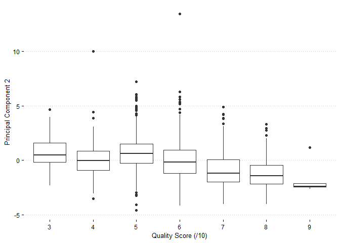

Exercises 3
================

# Problem 1: Predictive Model Building

## Approach

In our attempt to build the best predictive model possible for price, we
decided to focus on tree-based approaches since they tend to perform
particularly well at out-of-sample prediction. Before we could fit any
models, we first needed to clean the data and select the relevant
variables to utilize. Observations with any null values were dropped
because they only represented a very small portion of our sample (less
than 1%), and our model incorporated all available information besides
cluster id, LEED status, and Energystar status. Cluster id was excluded
because it was a factored variable with a very large number of levels,
and we were concerned that it would only introduce noise into the model.
Also, most (if not all) of the information captured by cluster id should
also be captured by cluster rent, so we were comfortable leaving it out.
LEED status and Energystar status were left out as we decided to focus
on evaluating the overall impact of “green certified” status, instead of
the specific impact of each specific certification.

## Modeling & Analysis

After cleaning the data, we split it into a training set and a testing
set so that we could evaluate out-of-sample performance for each of our
models. Then we trained models based on four different tree-based
methods: simple tree, bagging, random forest, and boosting. In order to
evaluate the performance of each of these models, we then calculated the
RMSE of each model on the testing data. The figures below show the
results of the out-of-sample testing. Unsurprisingly, all of the
ensemble methods (bagging, boosting, and random forest) outperformed the
simple tree model, with the random forest model performing the best.

<!-- --><!-- --><!-- --><!-- -->

After selecting the best predictive model, we then explored variable
importance and partial dependence. The variable independence plot below
shows that the cluster rent variable, representing the average rent per
square-foot in a building’s local market, is by far the most important
variable for accurate predictions. Variables like building size and
regional electricity costs are also important, but green certification
status is notably near the bottom of the list.

<!-- -->

Looking at the partial dependence plot for the green certification
status variable provides further evidence that the effect of this
particular variable is small. Holding all other features of the building
constant, the partial dependence analysis suggests that green
certification is associated with a $0.48 increase in rental income per
square foot. In evaluating whether to construct a green-certified
building, we would suggest that developers carefully consider whether
the certification will be worthwhile in light of the relatively modest
potential gains in rental income. If developers want to maximize rental
income, they may want to spend their capital on other building features
that are stronger predictors of rent according to our model, like market
location and size.

<!-- -->

# Problem 2: What Causes What?

## Question 1

We can’t simply run the regression of “crime” on “police” to estimate
the effect of the number of police on the crime rate because the
selection of policing level is endogenous. That is, governmental
decision-makers can and do decide how much money to spend on policing in
a locality based on its crime rate.

The ability to select the level of policing introduces selection bias
that prevents a consistent estimate of the effect of policing on crime.

## Question 2

In the 2005 article “Using Terror Alert Levels to Estimate the Effect of
Police on Crime”, Jonathan Klick and Alexander Tabarrok were able to
isolate the effect of policing on crime by identifying and examining a
situation in which the number of police in a locality is changed for
reasons unrelated to crime in that area. They identified just such a
situation: Washington, D.C., during a heightened terrorism alert level.
By law, if the Homeland Security Advisory System increases the
color-coded terrorism threat advisory scale to “orange”, extra police
officers are placed on the National Mall and throughout the rest of
Washington.

The researchers then examined what happens to street crime when the
number of police is increased during these periods of orange-alert. They
found that the rate of things like murder, robbery, and assault
decreased. Referring to the first column of the table (reproduced from
the paper) below, we can see the surge of police on crime is estimated
to have reduced the daily number of crimes in Washington by about 7 (not
controlling for variation in METRO ridership).

## Question 3

The authors had to control for METRO ridership to avoid running into a
problem with omitted variable bias. In order to obtain unbiased
estimators in OLS regressions, the error term must be uncorrelated with
the regressors (exogeneity). If an omitted variable has an effect on the
outcome and is correlated with one of the regressors, exogeneity will
not hold and the coefficient estimates will be biased.

In this case, one can hypothesize that the METRO ridership may be
correlated with high alert status and also have an effect on the crime
rate. If the high alert reduces the number of tourists in Washington, it
may suppress crime by diminishing the pool of possible victims. Klick
and Tabarrok use Metro ridership as a measure of tourism, and control
for that in the second column of the table above. The causal estimate is
reduced in that regression to a decrease of about 6 in the number of
crimes per day, but it is still statistically significant.

It is also worth noting that, despite the possible omitted variable bias
in their first regression, Klick and Tabarrok actually argue against the
idea that they have to control for Metro ridership:

> “We are skeptical of the latter explanation on theoretical grounds
> because holding all else equal, daily crime is unlikely to vary
> significantly based on the number of daily visitors. The vast majority
> of visitors to Washington D.C. are never the victim of a crime. Since
> there are far more visitors than crimes it seems unlikely that the
> number of visitors constrains the number of crimes.”

## Question 4

The model being estimated in the first column of the table below allows
for the effect of policing to vary between District 1 (home to the
city’s business and political center) and the rest of Washington,
while also controlling for Metro ridership. It uses
heteroskedasticity-robust (or White-Huber) standard errors. The estimate
from this model is that the extra policing reduces the number of daily
crimes by about 2.6 in District 1 and about .6 in other districts,
although the estimate for other districts is not statistically
significant.

# Problem 3: Clustering and PCA

In this exercise, we analyze data on eleven chemical properties of 6500
different bottles of *vinho verde* wine from northern Portugal. We
compare principal component analysis (PCA) and K-means++ clustering to
choose a method that easily distinguishes between red and white wine. We
further investigate the ability of each method to sort higher quality
wines from lower quality wines. We find that K-means++ is better for the
application of distinguishing white wine from red while PCA may capture
more information about wine quality.

## PCA

Running the PCA algorithm and plotting the first two principal
components, we find the figure below. It has two relatively well-defined
clusters: one centered at roughly (-2.5, 1) and the other centered at
roughly (1, 0).

<!-- -->

In the figure below, the points have been colored according to the color
of the corresponding wine. (To be clear, this information was not used
in the PCA calculation.) This figure shows that primary components 1 and
2 successfully separates white wine from red.

<!-- -->

Unfortunately, PCA alone gives us no algorithmic way to say which
observations should belong to each cluster. That would require a
clustering algorithm.

In the figure below, the second and third principle components are
plotted with the points now colored according to the quality score.
(This information was not used in the PCA calculation either.)
Obviously, this scatter plot does not have apparent clusters
corresponding to each quality score.

<!-- -->

However, one can see in the next two box plots that the second and third
principle components tend to decrease along with the quality score.
(Note that the direction may change, since PCA chooses direction
arbitrarily. I have set the seed to be able to replicate the same
findings.)

<!-- -->

<!-- -->

We can therefore say that PCA has some capability to sort the lower
quality from the higher quality wines.

## K-Means++

Now, we try running the K-means++ algorithm with K = 2, corresponding to
the two colors of the wines. We can look at a “confusion matrix” where
the “prediction” is not actually a prediction but an unsupervised
cluster assignment. This is shown in Table 1.

|       | Cl 1 | Cl 2 |
| ----- | ---: | ---: |
| red   |   24 | 1575 |
| white | 4830 |   68 |

Table 1: Cluster (horizontal) vs. color (vertical)

This is really effective\! The error rate is only
\((24+68)/6497 = 0.014\).

If we instead try to cluster with higher K-values, we find little of
interest. It’s not even clear which cluster might correspond to each
quality level, as shown in the violin plots below. (Note that “quality
score” is not a continuous variable. The violin plot interpolates values
between the integer values that the variable actually takes.) Some
clusters do have higher mean values of quality score, but the
distinction is definitely not clear as it was with the two groups of
“red” and “white”.

<!-- --><!-- --><!-- --><!-- --><!-- -->

## Which is better here?

The decision of which is better ultimately depends on the purpose of
dimensionality-reduction. Since this particular problem involves data
with two very well defined groups (“red” and “white”), clustering using
K-means++ seems like the intuitive choice for this data. As shown
previously by the confusion matrix, it performs well at distinguishing
reds from whites, but struggles sort higher quality wines from lower
quality wines (PCA was slightly more promising in this regard).

# Problem 4: Market Segmentation

## Approach

Our team chose to treat the task of identifying interesting market
segments for NutrientH20 as a clustering problem and attempted several
different approaches within the clustering family. Before starting,
however, we decided to perform a few transformations to try to make the
data more useful. First, we dropped the random alphanumeric code
associated with each user and created a new variable called
‘num\_tweets’ equal to the sum of all other columns in the dataset.
While we know that some tweets were classified as belonging to more than
one category during the data collection process, this variable should
still serve as a reasonable proxy for the social media engagement of a
given user. Next, we scaled down all other variables by the new
‘num\_tweets’ variable, so that each column now represented the
fraction of a given user’s engagement that fell within a certain
category.

## Modeling

After cleaning and transforming the data, we then proceeded to calculate
gap-statistics for both K-means and hierarchical clustering methods in
order to try to find an optimal number of groups for our data. In both
cases, the gap-statistic implied the trivial selection of a single
cluster which was not relevant for our use case, but there was also a
flattening or slight dip of the gap-statistic curve at k=13.

<!-- --><!-- -->

Without having prior intuition about the expected number of market
segments, we proceeded to fit both K-means++ and hierarchical clustering
models to the data with 13 clusters. While the K-means++ method yielded
relatively balanced clusters out-of-the-box, hierarchical clustering did
not yield balanced clusters using ‘simple’, ‘complete’, ‘average’, or
‘centroid’ linkage methods (‘complete’ was the most balanced of these
methods and still placed \~94% into a single cluster). To alleviate this
issue, we used a linkage method known as Ward clustering that is based
on minimizing the total within-cluster variance. Ward clustering yielded
much more balanced clusters that were in similar in size to the
K-means++ clusters.

<!-- --><!-- -->

In order to explore the defining characteristics of market segments, we
calculated each cluster’s average standard deviation from the mean for
each category. The diverging dot plots below shows the results of this
process, with points outside the red-dotted lines (which are 1 standard
deviation from the mean) highlighting the key characteristics of a given
cluster.

<!-- --><!-- -->

## Discussion of Clusters

We have given each cluster a name that indicates their identifying
characteristics.

1.  K-Means++ Cluster (KC) 4 (1302 obs), Hierarchical Cluster (HC) 5
    (802 obs): *The Online Shoppers* chatter, share photos, and tweet
    about shopping more than a standard deviation more often than
    average.
2.  KC 13 (1219 obs), HC 1 (1019 obs): *The Health-Conscious* tweet
    about personal fitness, health, and nutrition, and the outdoors more
    often than average.
3.  KC 5 (1008 obs), HC 2 (1048 obs): *The Suburban Parents* tweet about
    sports fandom, food, family, religion, parenting, and school more
    often than average.
4.  KC 3 (750 obs), HC 7 (759 obs): *The VSCO Girls* tweet about
    cooking, beauty, and fashion more than average.
5.  KC 10 (589 obs), HC 10 (612 obs): *The Sit-Com Dads* tweet about
    news and automotive much more than average. They also tweet about
    politics more than average and sports-fandom slightly more than
    average.
6.  KC 6 (533 obs), HC 4 (543 obs): *The Frat Boys* tweet more than
    average about online gaming, sports-playing, and college/university.
7.  KC 7 (527 obs), HC 6 (452 obs): *The Tech Bros* tweet more than
    average about travel, politics, news, and computers.
8.  KC 1 (422 obs), HC 9 (303 obs): *The College Creatives* tweet more
    than average about TV and film, music, small business, and college
    and university.
9.  KC 12 (353 obs), HC 3 (305 obs): *The Artists and Crafters* tweet
    more than average about TV and film, crafts, and art.
10. KC 8 (290 obs), HC 11 (301 obs): *The High Schoolers* tweet more
    than average about dating, school, and fashion.
11. KC 11 (216 obs), HC 12 (253 obs): *The NSFW Accounts* tweet adult
    content more than average.
12. KC 2 (37 obs), HC 13 (49 obs): *The Spammers* tweet adult content
    and spam more than average.

Two clusters didn’t have matches between the different clustering
methods.

  - HC 8 (1436 obs): *The Silent Plurality* has fewer tweets than
    average in every category.
  - KC 9 (636 obs): *The Noise-Makers* have more chatter, uncategorized
    tweets, and tweets about current events than average.

## Conclusions

Our analysis provides valuable information to NutrientH20 about the
different market segments that appear in their twitter audience. We can
also be confident about the robustness of our results, as multiple
methods identified largely similar groups. NutrientH20 should be able to
use this information to come up with targeted consumer engagement and
advertising campaigns. For example, while they may have already been
aware of *The Health-Conscious* segment of their audience (because of
their brand name), they might not have realized that *The Suburban
Parents* and *The Sit-Com Dads* combine to form an even larger market
segment. Thus, NutrientH20 could shift some of their advertising budget
to focus on reaching this particular demographic, perhaps by running ads
through partnerships with sports teams/events. They could also boost
engagement with *The Frat Boys* and *The College Creatives* by
sponsoring events on college campuses, or host a photo contest to engage
with *The Online Shoppers*. Regardless of the specific demographic that
NutrientH20 chooses to focus on, these groupings should give them a good
idea of how to create targeted content and boost consumer engagement.
