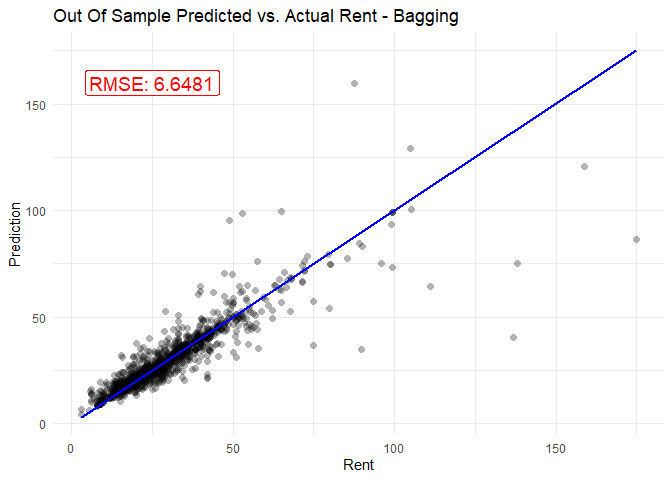
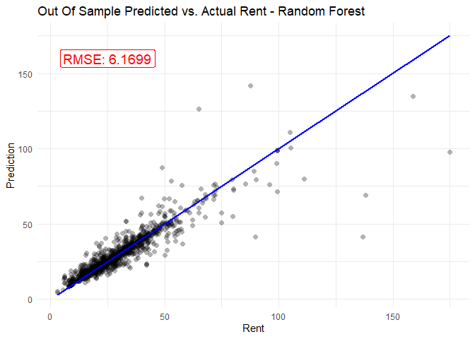
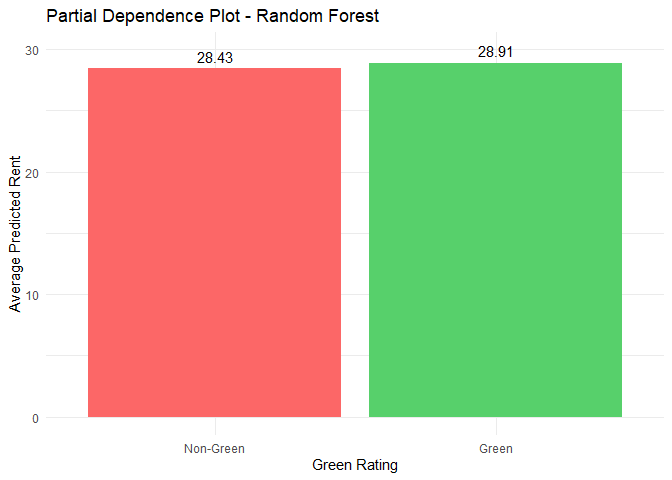

Problem 1
================

In our attempt to build the best predictive model possible for price, we
decided to focus on tree-based approaches since they tend to perform
particularly well at out-of-sample prediction. Before we could fit any
models, we first needed to clean the data and select the relevant
variables to utilize. Observations with any null values were dropped
because they only represented a very small portion of our sample (less
than 1%), and our model incorporated all available information besides
cluster id, LEED status, and Energystar status. Cluster id was excluded
because it was a factored variable with a very large number of levels,
and we were concerned that it would only introduce noise into the model.
Also, most (if not all) of the information captured by cluster id should
also be captured by cluster rent, so we were comfortable leaving it out.
LEED status and Energystar status were left out as we decided to focus
on evaluating the overall impact of “green certified” status, instead of
the specific impact of each specific certification.

After cleaning the data, we split it into a training set and a testing
set so that we could evaluate out-of-sample performance for each of our
models. Then we trained models based on four different tree-based
methods: simple tree, bagging, random forest, and boosting. In order to
evaluate the performance of each of these models, we then calculated the
RMSE of each model on the testing data. The figures below show the
results of the out-of-sample testing. Unsurprisingly, all of the
ensemble methods (bagging, boosting, and random forest) outperformed the
simple tree model, with the random forest model performing the best.

<!-- --><!-- --><!-- --><!-- -->

After selecting the best predictive model, we then explored variable
importance and partial dependence. The variable independence plot below
shows that the cluster rent variable, representing the average rent per
square-foot in a building’s local market, is by far the most important
variable for accurate predictions. Variables like building size and
regional electricity costs are also important, but green certification
status is notably near the bottom of the list.

<!-- -->

Looking at the partial dependence plot for the green certification
status variable provides further evidence that the effect of this
particular variable is small. Holding all other features of the building
constant, the partial dependence analysis suggests that green
certification is associated with a $0.48 increase in rental income per
square foot. In evaluating whether to construct a green-certified
building, we would suggest that developers carefully consider whether
the certification will be worthwhile in light of the relatively modest
potential gains in rental income. If developers want to maximize rental
income, they may want to spend their capital on other building features
that are stronger predictors of rent according to our model, like
location and size.

<!-- -->
