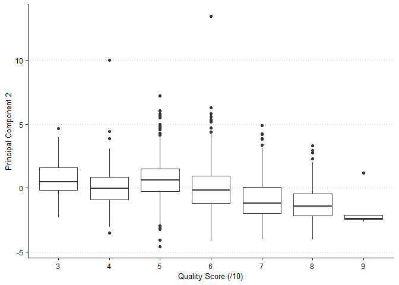

Exercise 3
================

In this exercise, we analyze data on the chemical properties of 6500
different bottles of *vinho verde* wine from northern Portugal. We
compare principal component analysis (PCA) and K-means++ clustering to
choose a method that easily distinguishes between red and white wine. We
further investigate the ability of each method to sort higher quality
wines from lower quality wines. We find that K-means++ is better for the
application of distinguishing white wine from red but that PCA captures
more information about wine
quality.

### PCA

<!-- -->

<!-- -->

<!-- -->

<!-- -->

<!-- -->

<!-- -->

### K-Means++

|       | Cl 1 | Cl 2 |
| ----- | ---: | ---: |
| red   | 1575 |   24 |
| white |   68 | 4830 |

Table with kable

|   | Cl 1 | Cl 2 | Cl 3 | Cl 4 | Cl 5 | Cl 6 | Cl 7 |
| - | ---: | ---: | ---: | ---: | ---: | ---: | ---: |
| 3 |    4 |    4 |    2 |    1 |    7 |    7 |    5 |
| 4 |   21 |   15 |   27 |    2 |   24 |   63 |   64 |
| 5 |   77 |  200 |  269 |   20 |  655 |  471 |  446 |
| 6 |  548 |  265 |  475 |    9 |  640 |  350 |  549 |
| 7 |  446 |  141 |  189 |    1 |  122 |   43 |  137 |
| 8 |   97 |   14 |   31 |    0 |   22 |    2 |   27 |
| 9 |    4 |    0 |    0 |    0 |    0 |    0 |    1 |

Table with kable

### Which is better here?
