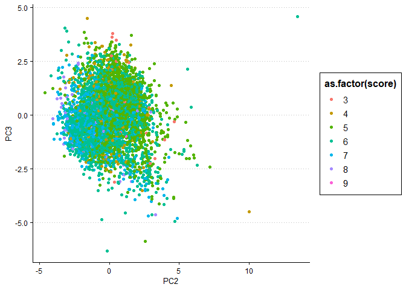

Exercise 3
================

In this exercise, we analyze data on eleven chemical properties of 6500
different bottles of *vinho verde* wine from northern Portugal. We
compare principal component analysis (PCA) and K-means++ clustering to
choose a method that easily distinguishes between red and white wine. We
further investigate the ability of each method to sort higher quality
wines from lower quality wines. We find that K-means++ is better for the
application of distinguishing white wine from red but that PCA captures
more information about wine quality.

### PCA

Running the PCA algorithm and plotting the first two principal
components, we find the figure below. It has two relatively well-defined
clusters: one centered at roughly (-2.5, 1) and the other centered at
roughly (1,
0).

<!-- -->

In the figure below, the points have been colored according to the color
of the corresponding wine. (To be clear, this information was not used
in the PCA calculation.) This figure shows that primary components 1 and
2 successfully separates white wine from
red.

<!-- -->

Unfortunately, PCA alone gives us no algorithmic way to say which
observations should belong to each cluster. That would require a
clustering algorithm.

In the figure below, the second and third principle components are
plotted with the points now colored according to the quality score.
(This information was not used in the PCA calculation either.)
Obviously, this scatter plot does not have apparent clusters
corresponding to each quality
score.

<!-- -->

However, one can see in the next two plots that the second and third
principle components tend to decrease along with the quality score.
(Note that the direction may change, since PCA chooses direction
arbitrarily. I have set the seed to be able to replicate the same
findings.)

<!-- -->

<!-- -->

We can therefore say that PCA has some capability to sort the lower
quality from the higher quality wines.

### K-Means++

Now, we try running the K-means++ algorithm with K = 2, corresponding to
the two colors of the wines. We can look at a “confusion matrix” where
the “prediction” is not actually a prediction but an unsupervised
cluster assignment. This is shown in Table 1.

|       | Cl 1 | Cl 2 |
| ----- | ---: | ---: |
| red   |   24 | 1575 |
| white | 4830 |   68 |

Table 1: Cluster (horizontal) vs. color (vertical)

This is really effective\! The error rate is only (24+68)/6497 = 0.014.

If we instead try to cluster with higher K-values, we find little of
interest. It’s not even clear which cluster might correspond to each
quality level, as shown in the violin plots below. (Note that “quality
score” is not a continuous variable. The violin plot interpolates values
between the integer values that the variable actually
takes.)

<!-- --><!-- --><!-- --><!-- --><!-- -->

### Which is better here?

The decision of which is better ultimately depends on the purpose of
this dimensionality-reduction technique. If the purpose is to classify
wines as “red” or “white” in an unsupervised manner, then K-means++ is
better. If the purpose is to predict the color or quality of an unknown
wine, then PCA (in addition to some sort of supervised classification
algorithm such as classification trees or OLS regression) is better.

Neither method is particularly useful for unsupervised sorting of wines
into higher or lower quality.
