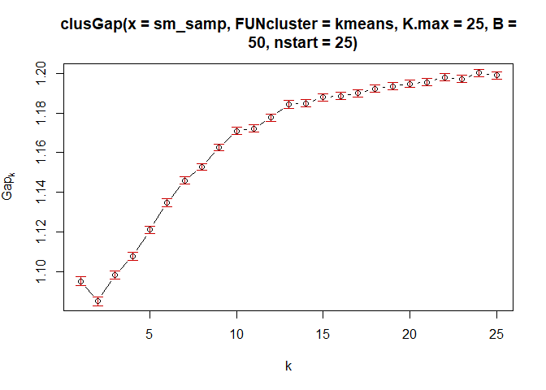
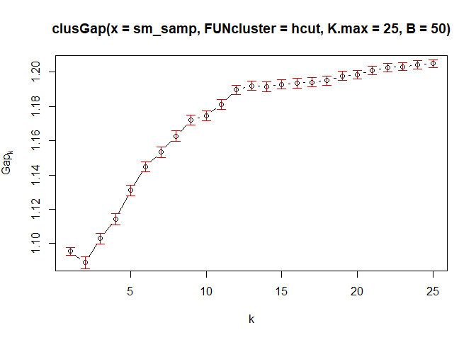
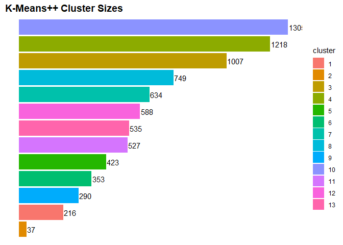
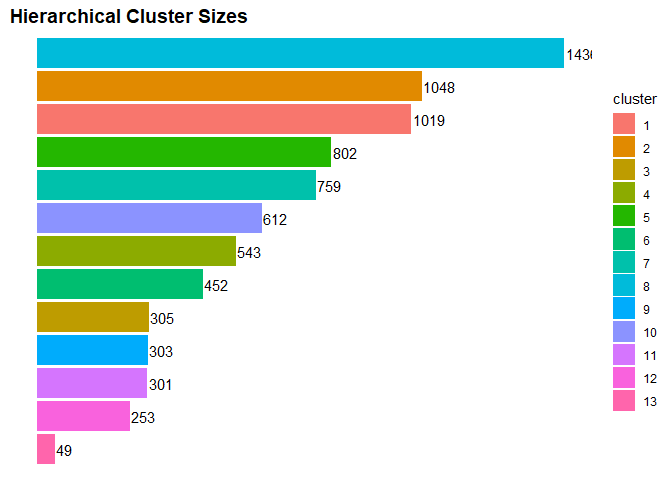
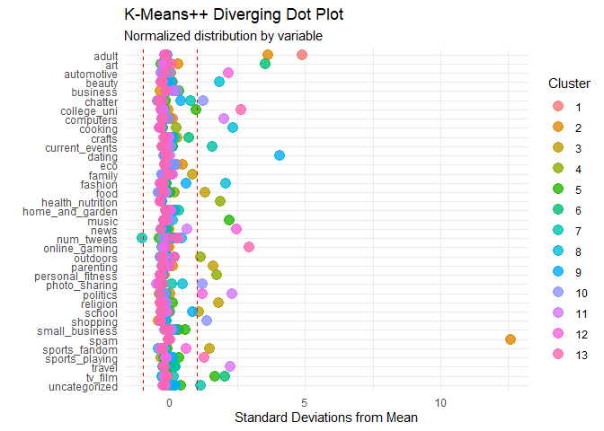

Problem 4
================

Our team chose to treat the task of identifying interesting market
segments for NutrientH20 as a clustering problem and attempted several
different approaches within the clustering family. Before starting,
however, we decided to perform a few transformations to try to make the
data more useful. First, we dropped the random alphanumeric code
associated with each user and created a new variable called
‘num\_tweets’ equal to the sum of all other columns in the dataset.
While we know that some tweets were classified as belonging to more than
one category during the data collection process, this variable should
still serve as a close proxy for the social media engagement of a given
user. Next, we scaled down all other variables by the new ‘num\_tweets’
variable, so that each column now represented the fraction of a given
user’s engagement that fell within a certain category.

After cleaning and transforming the data, we then proceeded to calculate
gap-statistics for both K-means and hierarchical clustering methods in
order to try to find an optimal number of groups for our data. In both
cases, the gap-statistic implied the trivial selection of a single
cluster which was not relevant for our use case, but there was also a
flattening or slight dip of the gap-statistic curve at
k=13.

<!-- --><!-- -->

Without having prior intuition about the expected number of market
segments, we proceeded to fit both K-means++ and hierarchical clustering
models to the data with 13 clusters. While the K-means++ method yielded
relatively balanced clusters out-of-the-box, hierarchical clustering did
not yield balanced clusters using ‘simple’, ‘complete’, ‘average’, or
‘centroid’ linkage methods (‘complete’ was the most balanced of these
methods and still placed \~94% into a single cluster). To alleviate this
issue, we used a linkage method known as Ward clustering that is based
on minimizing the total within-cluster variance. Ward clustering yielded
much more balanced clusters that were in similar in size to the
K-means++
clusters.

<!-- --><!-- -->

In order to explore the defining characteristics of market segments, we
calculated each cluster’s average standard deviation from the mean for
each category. The diverging dot plots below shows the results of this
process, with points outside the red-dotted lines (which are 1 standard
deviation from the mean) highlighting the key characteristics of a given
cluster.

<!-- --><!-- -->

    ##                         1         2        3        4        5        6
    ## chatter                NA        NA       NA       NA       NA       NA
    ## current_events         NA        NA       NA       NA       NA       NA
    ## travel                 NA        NA       NA       NA       NA       NA
    ## photo_sharing          NA        NA       NA       NA       NA       NA
    ## uncategorized          NA        NA       NA       NA       NA       NA
    ## tv_film                NA        NA       NA       NA 1.659329 2.029805
    ## sports_fandom          NA        NA 1.455466       NA       NA       NA
    ## politics               NA        NA       NA       NA       NA       NA
    ## food                   NA        NA 1.295079       NA       NA       NA
    ## family                 NA        NA       NA       NA       NA       NA
    ## home_and_garden        NA        NA       NA       NA       NA       NA
    ## music                  NA        NA       NA       NA 2.191240       NA
    ## news                   NA        NA       NA       NA       NA       NA
    ## online_gaming          NA        NA       NA       NA       NA       NA
    ## shopping               NA        NA       NA       NA       NA       NA
    ## health_nutrition       NA        NA       NA 1.874538       NA       NA
    ## college_uni            NA        NA       NA       NA       NA       NA
    ## sports_playing         NA        NA       NA       NA       NA       NA
    ## cooking                NA        NA       NA       NA       NA       NA
    ## eco                    NA        NA       NA       NA       NA       NA
    ## computers              NA        NA       NA       NA       NA       NA
    ## business               NA        NA       NA       NA       NA       NA
    ## outdoors               NA        NA       NA 1.116925       NA       NA
    ## crafts                 NA        NA       NA       NA       NA       NA
    ## automotive             NA        NA       NA       NA       NA       NA
    ## art                    NA        NA       NA       NA       NA 3.515729
    ## religion               NA        NA 1.787059       NA       NA       NA
    ## beauty                 NA        NA       NA       NA       NA       NA
    ## parenting              NA        NA 1.603170       NA       NA       NA
    ## dating                 NA        NA       NA       NA       NA       NA
    ## school                 NA        NA 1.061752       NA       NA       NA
    ## personal_fitness       NA        NA       NA 1.734781       NA       NA
    ## fashion                NA        NA       NA       NA       NA       NA
    ## small_business         NA        NA       NA       NA       NA       NA
    ## spam                   NA 12.587447       NA       NA       NA       NA
    ## adult            4.901486  3.615763       NA       NA       NA       NA
    ## num_tweets             NA        NA       NA       NA       NA       NA
    ##                          7        8       9       10       11       12       13
    ## chatter                 NA       NA      NA 1.240530       NA       NA       NA
    ## current_events    1.557930       NA      NA       NA       NA       NA       NA
    ## travel                  NA       NA      NA       NA 2.237411       NA       NA
    ## photo_sharing           NA       NA      NA 1.190122       NA       NA       NA
    ## uncategorized     1.117754       NA      NA       NA       NA       NA       NA
    ## tv_film                 NA       NA      NA       NA       NA       NA       NA
    ## sports_fandom           NA       NA      NA       NA       NA       NA       NA
    ## politics                NA       NA      NA       NA 2.290026 1.186056       NA
    ## food                    NA       NA      NA       NA       NA       NA       NA
    ## family                  NA       NA      NA       NA       NA       NA       NA
    ## home_and_garden         NA       NA      NA       NA       NA       NA       NA
    ## music                   NA       NA      NA       NA       NA       NA       NA
    ## news                    NA       NA      NA       NA       NA 2.452152       NA
    ## online_gaming           NA       NA      NA       NA       NA       NA 2.912434
    ## shopping                NA       NA      NA 1.347879       NA       NA       NA
    ## health_nutrition        NA       NA      NA       NA       NA       NA       NA
    ## college_uni             NA       NA      NA       NA       NA       NA 2.612139
    ## sports_playing          NA       NA      NA       NA       NA       NA 1.278281
    ## cooking                 NA 2.320768      NA       NA       NA       NA       NA
    ## eco                     NA       NA      NA       NA       NA       NA       NA
    ## computers               NA       NA      NA       NA 2.002219       NA       NA
    ## business                NA       NA      NA       NA       NA       NA       NA
    ## outdoors                NA       NA      NA       NA       NA       NA       NA
    ## crafts                  NA       NA      NA       NA       NA       NA       NA
    ## automotive              NA       NA      NA       NA       NA 2.158788       NA
    ## art                     NA       NA      NA       NA       NA       NA       NA
    ## religion                NA       NA      NA       NA       NA       NA       NA
    ## beauty                  NA 1.822244      NA       NA       NA       NA       NA
    ## parenting               NA       NA      NA       NA       NA       NA       NA
    ## dating                  NA       NA 4.04127       NA       NA       NA       NA
    ## school                  NA       NA      NA       NA       NA       NA       NA
    ## personal_fitness        NA       NA      NA       NA       NA       NA       NA
    ## fashion                 NA 2.052526      NA       NA       NA       NA       NA
    ## small_business          NA       NA      NA       NA       NA       NA       NA
    ## spam                    NA       NA      NA       NA       NA       NA       NA
    ## adult                   NA       NA      NA       NA       NA       NA       NA
    ## num_tweets       -1.014449       NA      NA       NA       NA       NA       NA

    ##                         1        2        3        4        5        6        7
    ## chatter                NA       NA       NA       NA 1.195898       NA       NA
    ## current_events         NA       NA       NA       NA       NA       NA       NA
    ## travel                 NA       NA       NA       NA       NA 2.164227       NA
    ## photo_sharing          NA       NA       NA       NA 1.052022       NA       NA
    ## uncategorized          NA       NA       NA       NA       NA       NA       NA
    ## tv_film                NA       NA 1.946699       NA       NA       NA       NA
    ## sports_fandom          NA 1.351621       NA       NA       NA       NA       NA
    ## politics               NA       NA       NA       NA       NA 2.428848       NA
    ## food                   NA 1.170117       NA       NA       NA       NA       NA
    ## family                 NA       NA       NA       NA       NA       NA       NA
    ## home_and_garden        NA       NA       NA       NA       NA       NA       NA
    ## music                  NA       NA       NA       NA       NA       NA       NA
    ## news                   NA       NA       NA       NA       NA       NA       NA
    ## online_gaming          NA       NA       NA 2.817173       NA       NA       NA
    ## shopping               NA       NA       NA       NA 1.526148       NA       NA
    ## health_nutrition 1.922887       NA       NA       NA       NA       NA       NA
    ## college_uni            NA       NA       NA 2.538054       NA       NA       NA
    ## sports_playing         NA       NA       NA 1.133153       NA       NA       NA
    ## cooking                NA       NA       NA       NA       NA       NA 2.171478
    ## eco                    NA       NA       NA       NA       NA       NA       NA
    ## computers              NA       NA       NA       NA       NA 1.665409       NA
    ## business               NA       NA       NA       NA       NA       NA       NA
    ## outdoors         1.117400       NA       NA       NA       NA       NA       NA
    ## crafts                 NA       NA       NA       NA       NA       NA       NA
    ## automotive             NA       NA       NA       NA       NA       NA       NA
    ## art                    NA       NA 3.604709       NA       NA       NA       NA
    ## religion               NA 1.652221       NA       NA       NA       NA       NA
    ## beauty                 NA       NA       NA       NA       NA       NA 1.778883
    ## parenting              NA 1.438893       NA       NA       NA       NA       NA
    ## dating                 NA       NA       NA       NA       NA       NA       NA
    ## school                 NA       NA       NA       NA       NA       NA       NA
    ## personal_fitness 1.743005       NA       NA       NA       NA       NA       NA
    ## fashion                NA       NA       NA       NA       NA       NA 1.992392
    ## small_business         NA       NA       NA       NA       NA       NA       NA
    ## spam                   NA       NA       NA       NA       NA       NA       NA
    ## adult                  NA       NA       NA       NA       NA       NA       NA
    ## num_tweets             NA       NA       NA       NA       NA       NA       NA
    ##                   8        9       10       11       12        13
    ## chatter          NA       NA       NA       NA       NA        NA
    ## current_events   NA       NA       NA       NA       NA        NA
    ## travel           NA       NA       NA       NA       NA        NA
    ## photo_sharing    NA       NA       NA       NA       NA        NA
    ## uncategorized    NA       NA       NA       NA       NA        NA
    ## tv_film          NA 1.942551       NA       NA       NA        NA
    ## sports_fandom    NA       NA       NA       NA       NA        NA
    ## politics         NA       NA 1.144501       NA       NA        NA
    ## food             NA       NA       NA       NA       NA        NA
    ## family           NA       NA       NA       NA       NA        NA
    ## home_and_garden  NA       NA       NA       NA       NA        NA
    ## music            NA 1.966284       NA       NA       NA        NA
    ## news             NA       NA 2.206660       NA       NA        NA
    ## online_gaming    NA       NA       NA       NA       NA        NA
    ## shopping         NA       NA       NA       NA       NA        NA
    ## health_nutrition NA       NA       NA       NA       NA        NA
    ## college_uni      NA 1.206160       NA       NA       NA        NA
    ## sports_playing   NA       NA       NA       NA       NA        NA
    ## cooking          NA       NA       NA       NA       NA        NA
    ## eco              NA       NA       NA       NA       NA        NA
    ## computers        NA       NA       NA       NA       NA        NA
    ## business         NA       NA       NA       NA       NA        NA
    ## outdoors         NA       NA       NA       NA       NA        NA
    ## crafts           NA       NA       NA       NA       NA        NA
    ## automotive       NA       NA 1.985040       NA       NA        NA
    ## art              NA       NA       NA       NA       NA        NA
    ## religion         NA       NA       NA       NA       NA        NA
    ## beauty           NA       NA       NA       NA       NA        NA
    ## parenting        NA       NA       NA       NA       NA        NA
    ## dating           NA       NA       NA 3.907957       NA        NA
    ## school           NA       NA       NA       NA       NA        NA
    ## personal_fitness NA       NA       NA       NA       NA        NA
    ## fashion          NA       NA       NA       NA       NA        NA
    ## small_business   NA       NA       NA       NA       NA        NA
    ## spam             NA       NA       NA       NA       NA 10.827822
    ## adult            NA       NA       NA       NA 4.379187  3.225323
    ## num_tweets       NA       NA       NA       NA       NA        NA

### Discussion of Clusters

We have given each cluster a name that indicates their comparatively
extreme characteristics.

1.  K-Means++ Cluster (KC) 4 (1302 obs), Hierarchical Cluster (HC) 5
    (802 obs): *The Online Shoppers* chatter, share photos, and tweet
    about shopping more than a standard deviation more often than
    average.
2.  KC 13 (1219 obs), HC 1 (1019 obs): *The Health-Conscious* tweet
    about personal fitness, health, and nutrition, and the outdoors more
    often than average.
3.  KC 5 (1008 obs), HC 2 (1048 obs): *The Suburban Parents* tweet about
    sports fandom, food, family, religion, parenting, and school more
    often than average.
4.  KC 3 (750 obs), HC 7 (759 obs): *The VSCO Girls* tweet about
    cooking, beauty, and fashion more than average.
5.  KC 10 (589 obs), HC 10 (612 obs): *The Sit-Com Dads* tweet about
    news and automotive much more than average. They also tweet about
    politics more than average and sports-fandom slightly more than
    average.
6.  KC 6 (533 obs), HC 4 (543 obs): *The Frat Boys* tweet more than
    average about online gaming, sports-playing, and college/university.
7.  KC 7 (527 obs), HC 6 (452 obs): *The Tech Bros* tweet more than
    average about travel, politics, news, and computers.
8.  KC 1 (422 obs), HC 9 (303 obs): *The College Creatives* tweet more
    than average about TV and film, music, small business, and college
    and university.
9.  KC 12 (353 obs), HC 3 (305 obs): *The Artists and Crafters* tweet
    more than average about TV and film, crafts, and art.
10. KC 8 (290 obs), HC 11 (301 obs): *The High Schoolers* tweet more
    than average about dating, school, and fashion.
11. KC 11 (216 obs), HC 12 (253 obs): *The NSFW Accounts* tweet adult
    content more than average.
12. KC 2 (37 obs), HC 13 (49 obs): *The Spammers* tweet adult content
    and spam more than average.

Two clusters didn’t have matches between the different clustering
methods.

  - HC 8 (1436 obs): *The Silent Plurality* has fewer tweets than
    average in every category.
  - KC 9 (636 obs): *The Noise-Makers* have more chatter, uncategorized
    tweets, and tweets about current events than average.
