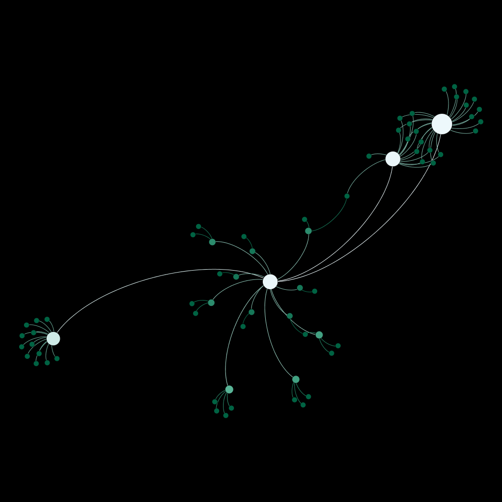

## Abstract

Using data from the Microsoft Academic Knowledge Graph, I investigate the optimal per-paper proportion of multidisciplinary cited works to total cited works. I find that approximately the 30th decile has the highest mean citation count per paper.

## Introduction

The division of scientific inquiry into different fields of inquiry has been fundamental to its continued progress. But "carving nature at its joints," as Plato put it in the *Phaedrus*, may also leave tractable scientific problems uninvestigated or investigated less ably than scientists from a different field with different mental models and skills may be able to. The syncretic act of bridging the joints between traditional fields of academic thought may help reserachers 

This project is concerned with scientometrics -- the measurement and analysis of scientific publications. (This project is actually concerned with *academic* publications more generally, including publications in the arts and humanities.) At first glance, this meta-scientific field may seem like so much navel-gazing on the part of the scientific community. However, it is important for the purpose of evaluating the effectiveness of scientific publishing and identifying ways in which it could be better. 

There is a pervasive intuition that those who engage deeply with multiple fields bring a different perspective to their fields than those who engage deeply with only one. Heinze and Bauer (2007) support this for intuition. They investigate whether authors in the field of nano-science and nano-technology who publish in multiple fields are more productive than those that publish in only one field. They find that authors who fill structural holes are more highly cited, controlling for number of papers published. They also cite two studies by R.S. Burt from 1992 and 2004 supporting this idea in the space of firms and employees.  

I want to test whether this result holds at the paper level, not just at the author level. This could provide guidance to the optimal level of multidisciplinary research when writing a paper.


## Methods

For this project I used the [Microsoft Academic Knowledge Graph](http://ma-graph.org/), a data set featuring over 200,000,000 papers published in over 48,000 journals by over 250,000,000 authors affiliated with over 25,000 institutions.The Microsoft Academic Knowledge Graph is encoded as a Resource Description Framework (RDF) graph, accessible via a SPARQL Protocol and RDF Query Language (SPARQL) end point. 

I used the software packages RStudio for analysis of the data and Gephi for visualization of the networks. I used a Gephi plug-in called "Semantic Web Import" for importing the RDF data with an implementation of SPARQL Protocol and RDF Query Language (SPARQL). I also used Python to automate SPARQL queries.

The sheer number of papers in the data set means that the network structure of any random subsample for which visualization and calculation of summary statistics are computationally feasible with my current resources would be unrepresentative and highly variant. This means that I was not able to visualize significant portions of the data.

The measure of multidisciplinarity I chose was influenced by the data I had available. The Microsoft Academic Knowledge Graph contains data on the "field of study" of most papers in the data base, but it was not hierarchical. That is, "parent" fields shared "child" fields. This can be seen in the plot below, which contains the field "Polymerization" (located centrally) and its "child" and "grandchild" fields. The upper right portion of the network contains fields that branch and then return.



The non-hierarchical nature of the reduced its usability for the purpose of segmenting by multidisciplinarity; many fields are themselves interdisciplinary. The accuracy of the classification of papers into different fields of study was also called into question by random spot-checks I performed. For example, many papers classified as belonging to the field of development economics were in fact more accurately classified as history or sociology papers.

Instead I used data for the field of study at the journal level from SCImago. This provided a list of fields that each journal publishes in, aggregated together into the "compound field". For example, on compound field is "Biophysics; Biochemistry". The journals were then matched by ISSN or by name between the two data sets. Queries to the Microsoft Academic Knowledge Graph were sent to obtain data on all papers published in sets of journals with matching compound fields. Quantile calculations as detailed below were then performed for all papers for each compound field.

The metric of success used here is the number of citations as reported by the Microsoft Academic Knowledge Graph. Something like betweenness or Page rank would be preferable, but calculating such statistics for the tens of millions of papers in the sample was infeasible.

The metric of multidisciplinarity used here is a paper's proportion of papers cited that are outside the compound field associated with the journal in which the (citing) paper was published. Thus, a paper's citation is considered multidisciplinary if the intersection of the compound field of the citing paper and the compound field of the cited paper is empty.

## Results

```{r setup, include=F}
library(tidyverse)
library(data.table)

mean_citation_count_data = as.data.table(read.csv("../data/results_meancitationCount_global.csv"))

centile_reflow_data = data.table()

for(i in 1:6019)
  {
  centile_reflow_row = data.table('centile' = 1:100, 
                                  'mean_citation_count' = t(mean_citation_count_data[i, c(5:19, 102, 20:48, 103, 49:67, 104, 68:101)]), 
                                  'field' = mean_citation_count_data[i, 'field'])
  centile_reflow_data = rbind(centile_reflow_data, centile_reflow_row)
  }

centile_reflow_data[centile_reflow_data$centile%%10 == 0, 'decile'] = centile_reflow_data[centile_reflow_data$centile%%10 == 0, ]$centile/10
```

In the graph below, the y-axis represents the mean citation count per field and the x-axis represents the centile of the proportion of multidisciplinary papers cited to all papers cited. An observation is recorded for each centile of the 6140 fields in the journal data. A quadratic is fit to the data to allow for a maximum citation count to be found.

```{r fit_plot, echo=F, warning=F}

ggplot(data = centile_reflow_data) +
  geom_smooth(aes(x = centile, y = mean_citation_count.V1), method = 'lm', formula = y ~ x + I(x^2)) +
  xlab('Centile of "Multidisciplinarity"') +
  ylab('Per-field Mean Citation Count')

```

The graph below represents the deciles of the fields instead. (The violin plots continue much higher, but with ever-diminishing width.)

```{r violin_plot, echo=F, warning=F}

ggplot(data = subset(centile_reflow_data, ! is.na(decile))) +
  geom_violin(aes(x = as.factor(decile), y = mean_citation_count.V1)) +
  coord_cartesian(ylim=c(0, 75)) +
  xlab('Decile of "Multidisciplinarity"') +
  ylab('Per-field Mean Citation Count')

```

We can see from the quadratic fit that the mean number of citations peaks at approximately the 30th centile of proportion of multidisciplinary papers cited to all papers cited. The violin plot also supports the 30th centile or 3rd decile. This of course is a purely correlative result, but it may still afford an estimate of the optimal level of multidisciplinarity in citation.

## Conclusion

While this investigation was limited in scope to the optimal level of multidisciplinarity in citation, it provides a useful baseline of approximately the 30th centile of the proportion of multidisciplinary papers cited to all papers cited. 

This work could be extended with more refined measures of paper success than the crude number of citations. (Such as betweenness or Page rank.) It could also, following in the work of Heinze & Bauer (2007), be generalized to the author level.

## Citations

Färber M. (2019) The Microsoft Academic Knowledge Graph: A Linked Data Source with 8 Billion Triples of Scholarly Data. In: Ghidini C. et al. (eds) The Semantic Web – ISWC 2019. ISWC 2019. Lecture Notes in Computer Science, vol 11779. Springer, Cham

Heinze, T., & Bauer, G. (2007). Characterizing creative scientists in nano-S&T: Productivity, multidisciplinarity, and network brokerage in a longitudinal perspective, Scientometrics, 70(3), 811-830. Retrieved May 4, 2020, from https://akjournals.com/view/journals/11192/70/3/article-p811.xml

SCImago, (n.d.). SJR — SCImago Journal & Country Rank [Portal]. Retrieved May 5, 2020, from http://www.scimagojr.com

## Appendix

See the online appendix at <https://github.com/nfra/DataScienceCourseHomework/blob/master/final_project/writing/interdisciplinarity_appendix.md> for my SPARQL queries and the Python code I used to automate the 6140 queries I ran for each compound field.


