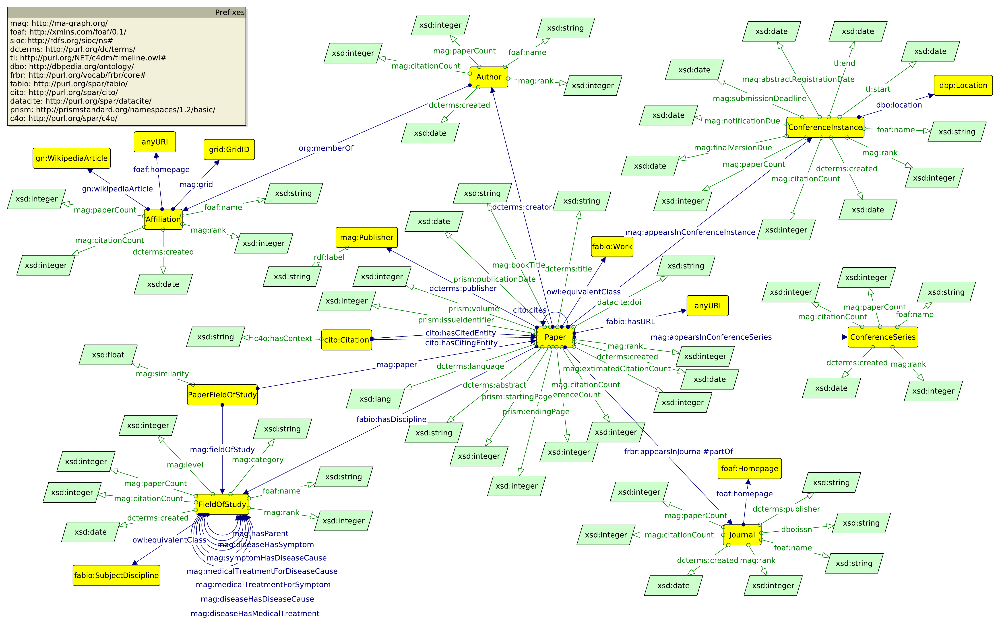

The Selfish Rewards of Multidisciplinarity: Online Appendix
================
Nathan Franz

## Microsoft Academic Knowledge Graph Schema

This is a diagram of the structure of the data in the Microsoft Academic
Knowledge Graph data set.



## Polymerization Graph SPARQL Query

    PREFIX rdf: <http://www.w3.org/1999/02/22-rdf-syntax-ns#>
    PREFIX magp: <http://ma-graph.org/property/>
    
    
    CONSTRUCT
    {
    ?field magp:hasParent <http://ma-graph.org/entity/44228677> .
    ?childField magp:hasParent ?field .
    }
    
    WHERE 
    {
    ?field rdf:type <http://ma-graph.org/class/FieldOfStudy> .
    ?field magp:hasParent <http://ma-graph.org/entity/44228677> .
    ?childField magp:hasParent ?field .
    }

## Journal Data SPARQL Queries

These two queries were used to query the Microsoft Academic Knowledge
Graph for a list of all journals (with an ISSN recorded, in the second
query) in the database.

## Journal Data R Script

This was run using data from the [Scimago Journal
Rank](https://www.scimagojr.com/journalrank.php?out=xls) and from
results from the SPARQL queries above.

    library(tidyverse)
    library(stringi)
    
    # read data
    journals_scimago = read.csv("./data/journals_scimago.csv")
    journals_ma_graph = read.csv("./data/journals_ma_graph.csv")
    journals_ma_graph_issn = read.csv("./data/journals_ma_graph_issn.csv")
    
    # remove dashes in ISSN for matching
    journals_ma_graph_issn[['issn_no_dash']] = str_remove(journals_ma_graph_issn[['issn']], "-")
    
    # add ISSNs to larger ma-graph list for those journals that have them
    journals_ma_graph$issn = journals_ma_graph_issn[match(journals_ma_graph$name, journals_ma_graph_issn$name),"issn_no_dash"]
    
    # clean up broken Unicode in names from ma-graph
    journals_ma_graph$name = str_replace_all(journals_ma_graph$name, "&amp;", "and")
    journals_ma_graph$name = str_replace_all(journals_ma_graph$name, "&#039;", "'")
    journals_ma_graph$name = str_replace_all(journals_ma_graph$name, "&#x00E9;", "e")
    journals_ma_graph$name = str_replace_all(journals_ma_graph$name, "&#x2013;", "-")
    
    # remove diacritics in names from ma-graph
    journals_ma_graph$name = stri_encode(stri_trans_general(journals_ma_graph$name, id = "Latin-ASCII"), to = "UTF8")
    
    # remove punctuation in names from both datasets
    journals_ma_graph$name = str_remove_all(journals_ma_graph$name, "[^[:alnum:]]")
    journals_scimagov$name = str_remove_all(journals_ma_graph$name, "[^[:alnum:]]")
    
    # match between datasets by ISSN and name
    journals_ma_graph$issn_match = pmatch(journals_ma_graph$issn, journals_scimago$Issn)
    journals_ma_graph$name_match = match(str_remove_all(stri_trans_general(journals_ma_graph$name, id = "lower"), "[^[:alnum:]]"), 
                                         str_remove_all(stri_trans_general(journals_scimago$Title, id = "lower"), "[^[:alnum:]]")
                                         )
    
    # make final match, privileging issn match
    journals_ma_graph$match = journals_ma_graph$issn_match
    journals_ma_graph[is.na(journals_ma_graph$match),'match'] = journals_ma_graph[is.na(journals_ma_graph$match),'name_match']
    
    # make merged dataset
    journals_both_ma_graph = subset(journals_ma_graph, !is.na(match))
    journals_both_scimago = journals_scimago[journals_both_ma_graph$match,]
    journals_both = cbind(journals_both_ma_graph, journals_both_scimago)
    
    # export merged dataset
    journals_for_python = journals_both[,c('journal','Categories')]
    
    journals_for_python$journal = stri_encode(journals_for_python$journal, to = "UTF8")
    journals_for_python$Categories = stri_encode(journals_for_python$Categories, to = "UTF8")
    
    write.csv(journals_for_python, "./data/journals_merged.csv")
    
    
    paste(str_replace_all(economics_journals$journal, "http://ma-graph.org/entity/", ":"), collapse = " ")
    
    economics_papers = read.csv("./data/econ_papers.csv")

## SPARQL Query Python Script

This takes approximately 20 hours to run.

    import pandas
    from SPARQLWrapper import SPARQLWrapper, JSON
    import json
    import time
    
    
    journal_data = pandas.read_csv("C:/Users/Nathan/Documents/UT Courses/3. Spring 2019/Data Mining, Statistical Learning/Homework/DataScienceCourseHomework/final_project/data/journals_merged.csv", encoding = "utf-8")
    
    # define SPARQL query
    # this query returns all papers published in English between 2000 and 2015 
    #   in all journals in the same field (defined by scimago journal data), 
    #   their journals, their citation count, the papers they cite, 
    #   and the journals in which the papers they cite were published
    url = 'http://ma-graph.org/sparql' # set SPARQL end point URL
    query_first_half = """
    PREFIX : <http://ma-graph.org/entity/>
    PREFIX xsd: <http://www.w3.org/2001/XMLSchema#>
    SELECT ?paper ?journal ?citationCount ?citedPaper ?citedJournal
    WHERE{ 
    VALUES ?journal {"""
    query_second_half =   """}
    ?paper <http://www.w3.org/1999/02/22-rdf-syntax-ns#type><http://ma-graph.org/class/Paper>;
    <http://ma-graph.org/property/appearsInJournal>?journal;
    <http://ma-graph.org/property/citationCount>?citationCount;
    <http://purl.org/dc/terms/language>"en"^^xsd:language;
    <http://prismstandard.org/namespaces/1.2/basic/publicationDate>?pubDate;
    <http://purl.org/spar/cito/cites>?citedPaper.
    ?citedPaper<http://ma-graph.org/property/appearsInJournal>?citedJournal.
    FILTER(?pubDate>"1999-12-31"^^xsd:date)
    FILTER(?pubDate<"2016-01-01"^^xsd:date)
    }
    """
    
    field_dictionary = dict() #initialize dictionary
    
    # assemble dictionary of all fields
    for row_number in range(len(journal_data)):
        row = journal_data.iloc[row_number]
        journal_id = row[["journal"]][0]
        journal_fields = row[["Categories"]][0]
        
        # clean up journal fields for parsing
        journal_fields = str.replace(journal_fields," (Q1)","")
        journal_fields = str.replace(journal_fields," (Q2)","")
        journal_fields = str.replace(journal_fields," (Q3)","")
        journal_fields = str.replace(journal_fields," (Q4)","")
        
    
        # add dictionary entries
        if field_dictionary.get(journal_fields) is None: #initialize
            field_dictionary[journal_fields] = list()
        field_dictionary[journal_fields].append(journal_id)
        print(row_number)
    
    
    # initialize global vars for loop 
    finished = list() # in case of interruption, be sure to update this!
    index = 0
    
    # perform query for all fields and save results
    for field, set_of_journals in field_dictionary.items():
        index += 1 # increment index
        print(index, "out of 6140") # print progress statement
        if (field not in finished): # in case of resumption, avoid repeating queries
            journals = '' # initialize journals string
            # build journals string for query
            for journal in set_of_journals: 
                journal_abbr = str.replace(journal,"http://ma-graph.org/entity/",":")
                journals = journals + journal_abbr + " "
            
            journal_values = journals # unnecessary variable change, I guess?
            query = query_first_half + journal_values + query_second_half # assemble query
            
            try:
                sparql = SPARQLWrapper(url) # set SPARQL end point
                sparql.setQuery(query) # set SPARQL query
                sparql.setReturnFormat(JSON) # set JSON return format (CSV seemed not to work)
                results = sparql.query().convert() # perform query
           
            # in case attempt to reach site fails, wait a minute and try again
            except: 
                print("exception here")
                time.sleep(60)
                sparql = SPARQLWrapper(url)
                sparql.setQuery(query)
                sparql.setReturnFormat(JSON)
                results = sparql.query().convert()
            
            # construct filename - Windows has filename limit of 260 chars
            field_short = str.replace(field,"(miscellaneous)","(misc)")
            field_short = str.replace(field_short,"and ","")
            field_short = str.replace(field_short," ","")
            field_short = field_short[:247]  
            filepath = "E:/data/" + field_short + ".txt"
            
            # export results to file
            with open(filepath, 'w') as outfile:
                json.dump(results, outfile)
    
            finished.append(field) # keep track of finished queries

## Centile Summary R Script

This took my desktop about 6 hours to run.

``` 
library(jsonlite)
library(data.table)
library(tidyverse)
library(stats)

# load journal information
journal_fields = as.data.table(read.csv("C:/Users/Nathan/Documents/journals_merged.csv"))[,2:3]
journal_fields$Categories = str_remove_all(as.character(journal_fields$Categories), ' [(]Q[1-4][)]')
journal_fields$fields_disagg = strsplit(as.character(journal_fields$Categories), "; ")


# loop through all files
results_meancitationCount_global = data.table()
results_sdcitationCount_global = data.table()
results_meancitedPaperMult_global = data.table()
results_meancitedPaper_global = data.table()
results_numberInQuantile_global = data.table()
i = 0
for(field_in_question in unique(journal_fields$Categories))
{
  i = i + 1
  print(paste(i, '/6140: ' ,field_in_question, sep=''))
  
  # define file path
  filename = substr(str_remove_all(str_replace_all(str_remove_all(field_in_question, "and "), "[(]miscellaneous[)]", "(misc)"), " "), 1, 247)
  filepath = paste('C:/data/', filename, '.txt', sep = '')
  
  # load paper data
  paper_data = as.data.table(fromJSON(filepath)[["results"]][["bindings"]])
  if(is_empty(paper_data)){next}
  
  # add journal field data
  paper_data$citedJournalFields = journal_fields[match(paper_data$citedJournal.value, journal_fields$journal), 'fields_disagg']
  
  # take subset of cited papers published in journals with field data
  paper_data = subset(paper_data, !(apply(paper_data[,'citedJournalFields'], MARGIN = 1, FUN = function(x) is.null(unlist(x)))))
  
  # separate all fields in aggregated field string
  field_in_question_split = flatten(strsplit(field_in_question, "; "))
  
  # add columns evaluating whether there's any overlap between fields of journals and cited journals
  for(field in field_in_question_split)
  {
    paper_data[[field]] = apply(paper_data[,'citedJournalFields'], MARGIN = 1, FUN = function(x, y) is.element(y, unlist(x)), y = field)
  }
  
  # define the length of the dataframe
  end_column_num = length(paper_data)
  
  # add column categorizing as single-disciplinary and multidisciplinary
  paper_data$multidisciplinary = TRUE
  paper_data[apply(paper_data[, 13:end_column_num], MARGIN = 1, FUN = any), 'multidisciplinary'] = FALSE
  
  # group all cited paper fields together
  paper_data_grouped = paper_data %>%
    group_by(journal.value, paper.value) %>%
    summarize(citationCount.value = mean(as.numeric(citationCount.value)),
              citedJournalFields = list(unique(unlist(citedJournalFields))),
              numberCitedPapers_multidisciplinary = sum(multidisciplinary),
              numberCitedPapers = n()
    )
  
  paper_data_grouped = setDT(paper_data_grouped)[, quantile := .bincode(numberCitedPapers_multidisciplinary/numberCitedPapers,
                                                                   quantile(numberCitedPapers_multidisciplinary/numberCitedPapers, probs = seq(0, 1, 0.01)),
                                                                   include.lowest = TRUE)
                                                 ]
  
  # group all cited paper fields together
  paper_data_quantiles = paper_data_grouped %>%
    group_by(quantile) %>%
    summarize(meanCitationCount = mean(citationCount.value),
              sdCitationCount = sd(citationCount.value),
              citedJournalFields = list(unique(unlist(citedJournalFields))),
              meanCitedPapers = mean(numberCitedPapers),
              meanCitedPapers_multidisciplinary = mean(numberCitedPapers_multidisciplinary),
              numberInQuantile = n()
    )
  
  # construct summary statistics
  obs = nrow(paper_data_grouped)
  mean_cited = mean(paper_data_grouped$numberCitedPapers)
  mean_cited_mult = mean(paper_data_grouped$numberCitedPapers_multidisciplinary)
  
  # construct centile datatables
  centile_column_names = as.character(paper_data_quantiles$quantile)
  
  centiles_meanCitationCount = data.table(t(paper_data_quantiles$meanCitationCount))
  names(centiles_meanCitationCount) = centile_column_names
  centiles_sdCitationCount = data.table(t(paper_data_quantiles$sdCitationCount))
  names(centiles_sdCitationCount) = centile_column_names
  centiles_meanCitedPaperMult = data.table(t(paper_data_quantiles$meanCitedPapers_multidisciplinary))
  names(centiles_meanCitedPaperMult) = centile_column_names
  centiles_meanCitedPapers = data.table(t(paper_data_quantiles$meanCitedPapers))
  names(centiles_meanCitedPapers) = centile_column_names
  centiles_numberInQuantile = data.table(t(paper_data_quantiles$numberInQuantile))
  names(centiles_numberInQuantile) = centile_column_names
  
  # make result data frame rows
  results_meancitationCount_local = cbind(data.table('field' = field_in_question, 'obs' = obs, 'mean_cited' = mean_cited, 'mean_cited_mult' = mean_cited_mult),
                                          centiles_meanCitationCount)
  results_sdcitationCount_local = cbind(data.table('field' = field_in_question, 'obs' = obs, 'mean_cited' = mean_cited, 'mean_cited_mult' = mean_cited_mult),
                                        centiles_sdCitationCount)
  results_meancitedPaperMult_local = cbind(data.table('field' = field_in_question, 'obs' = obs, 'mean_cited' = mean_cited, 'mean_cited_mult' = mean_cited_mult),
                                           centiles_meanCitedPaperMult)
  results_meancitedPaper_local = cbind(data.table('field' = field_in_question, 'obs' = obs, 'mean_cited' = mean_cited, 'mean_cited_mult' = mean_cited_mult),
                                       centiles_meanCitedPapers)
  results_numberInQuantile_local = cbind(data.table('field' = field_in_question, 'obs' = obs, 'mean_cited' = mean_cited, 'mean_cited_mult' = mean_cited_mult),
                                         centiles_numberInQuantile)
  
  # bind local results to global results
  results_meancitationCount_global = bind_rows(results_meancitationCount_global, results_meancitationCount_local)
  results_sdcitationCount_global = bind_rows(results_sdcitationCount_global, results_sdcitationCount_local)
  results_meancitedPaperMult_global = bind_rows(results_meancitedPaperMult_global, results_meancitedPaperMult_local)
  results_meancitedPaper_global = bind_rows(results_meancitedPaper_global, results_meancitedPaper_local)
  results_numberInQuantile_global = bind_rows(results_numberInQuantile_global, results_numberInQuantile_local)
}

```
